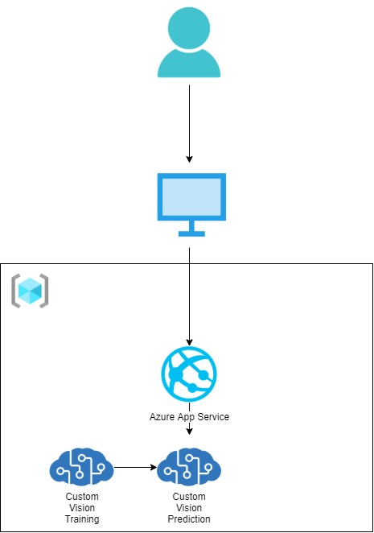
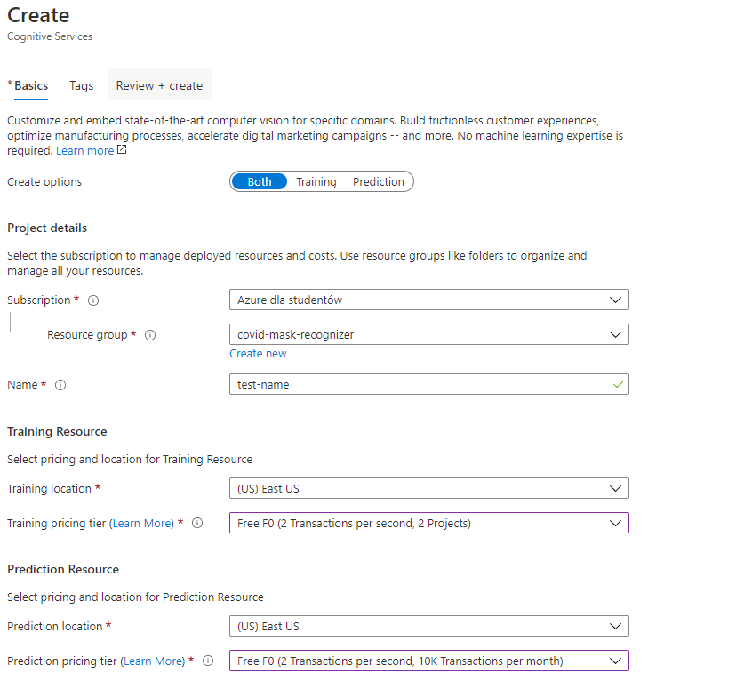
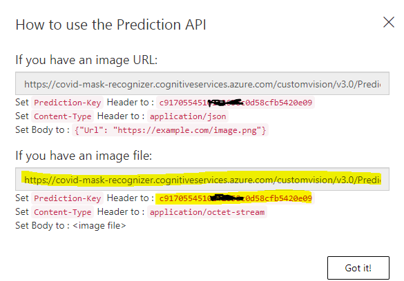

# Covid Mask Recognizer - built with Custom Vision

## Use Case

Application was created to help determine if a person is wearing a face mask. It can be used in entries to restaurants,
hotels, government facilities to alarm if a person without safety precautions is heading towards.

### Demo

Link to [DEMO](https://www.youtube.com/watch?v=AepTL3Bky9g&feature=youtu.be&ab_channel=Micha%C5%82Kolendo)

## Architecture

Application was created with [ASP .Net Core 3.1 MVC](https://docs.microsoft.com/en-us/aspnet/core/tutorials/first-mvc-app/start-mvc?view=aspnetcore-3.1&tabs=visual-studio)
The whole system was built on this framework with a HttpClient making prediction request to Custom Vision Prediction Service.

### Architecture Diagram

## How to recreate the system

Prerequisites:

- microsoft account
- active subscription on given microsoft account
- installed [.Net Core 3.1 SDK](https://dotnet.microsoft.com/download/dotnet-core/3.1)
- IDE for launching application [Visual Studio 2019](https://visualstudio.microsoft.com/pl/vs/) or [VS Code](https://code.visualstudio.com/)

1. Go to Azure Portal and Create a new resource group.

1. Inside that resource group, create a **Custom Vision** service. Remember to select **Both** when choosing between options
*Both* , *Training* and *Prediction*

1. Create **Prediction** and **Training** Services in the same **Location** Select **F0** for both of them as a pricing tier.

1. Enter [Custom Vision Service Portal](https://www.customvision.ai/) and **Sign In**.

1. Select **Create new project** and in the dropdown "Resource" you should select your resource created before.

1. Select Project Type - Classification, Classification Type - Multilabel and Domain - General.

1. Click **Add images** and upload images from [faces with mask dataset](https://github.com/kolendomichal/AI-on-Microsoft-Azure/tree/master/AI%20Computer%20Vision/MaskRecognizer/DataSets/with). Add tag **with-mask**.

1. Repeat the process for [faces without mask dataset](https://github.com/kolendomichal/AI-on-Microsoft-Azure/tree/master/AI%20Computer%20Vision/MaskRecognizer/DataSets/without). Add tag **without-mask**.

1. Next, Train the model. That might take a while so be patient.

1. After training is finished, go to **Performance** tab and click **Publish**.

1. After publishin your prediction, click on **Prediction Url**.  Copy second **URL** and **Prediction-Key**

1. Lastly, edit [appsettings.json](path_to_appsettings.json) and supply URL to *CustomVisionUrl* and Prediction-Key to *CustomVisionSubscriptionKey*.

1. Launch application and test it yourself!

**Custom Vision Azure Blade creation**

**URL and Prediction-Key to copy**

