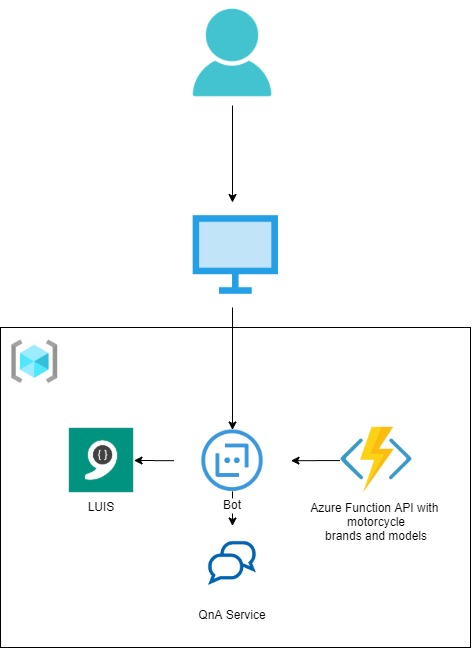
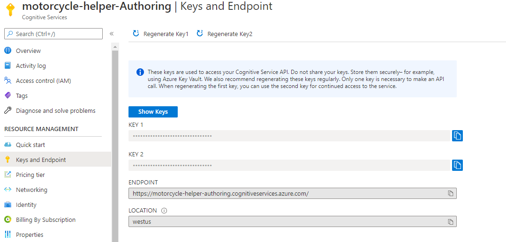
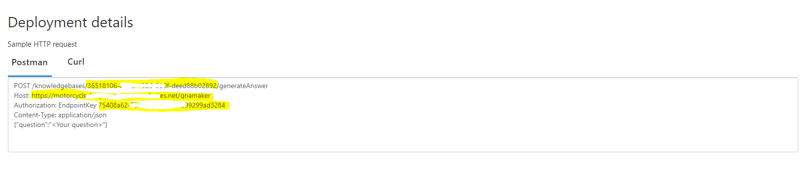
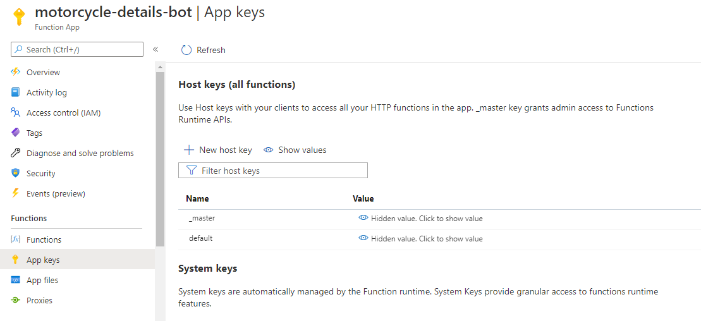
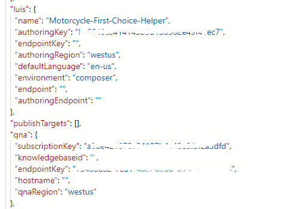
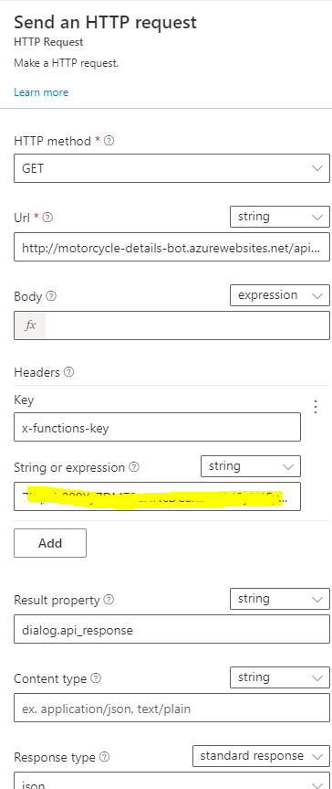

# MotorcycleFirstChoiceHelperBot - built with Azure Bot Service

This is a report from creating chat bot for help with coronavirus and medical cases during the pandemic.

## Use Case

Bot was created to help young passionate future motorcycle riders to find some good starting motorcycles, learn what to watchout for when buying a used motorcycle and some advices on what gear to wear!

### Demo
Link to [demo](link_to_demo)

## Architecture

Bot was created with Bot Framework Composer tool.
It is composed of three main services:

- Language Understanding (LUIS) which recognizes user intents.
- QnA Service for answering advices questions.
- Custom Azure Function API for fetching data about motorcycles.

### Architecture Diagram

## How to recreate the bot

Bot was created using Bot Framework Composer. Every action and dialog was created in Composer UI.

1. Firstly Download Bot Framework Composer from [here](https://github.com/microsoft/BotFramework-Composer/releases).

2. To test your bot and run your bot locally you need to install Azure Bot Framework Emulator from [here](https://github.com/Microsoft/BotFramework-Emulator/releases).

3. Now it time to create LUIS service, a QnA service and your Azure Function!
   - LUIS
     1. Create LUIS service in the **West US** region. LUIS will not work for your composer, if it is created in other region.
     2. Go to [luis.ai](https://www.luis.ai), log in and copy **Authoring Key**. It will be pasted into bot settings.
   - QnA Service
     1. Create QnA service.
     2. Go to [qnamaker.ai](https://www.qnamaker.ai/)
     3. Create new knowledge base and in step 4 import knowledge base file from [here](knowledge base link)
     4. Save and train your knowledge base
     5. Go to settings and copy **KnowledgeBaseId** , **EndpointKey** and **Host**. These settings will be pasted into bot settings
   - Azure Function
     1. Open project located in bot framework folder [MotorcycleChoiceHelper.sln](https://github.com/kolendomichal/AI-on-Microsoft-Azure/blob/master/AI%20Machine%20Learning/bot/MotorcycleChoiceHelper/MotorcycleChoiceHelper.sln).
     2. Launch it in Visual Studio 2019.
     3. Right click project name and select **Publish**. Go through all the steps and deploy it in your resource group.
     4. Navigate to your Azure Function in Azure and copy App key **_master**

Images with keys to copy:

**Authoring key**

**KnowledgeBaseId** , **EndpointKey** and **Host**.

**Function App Key**

Paste LUIS and QnA settings into bot settings:

Paste Azure Function app key into two HTTP requests in **BeginnerMotorcycleDialog**

